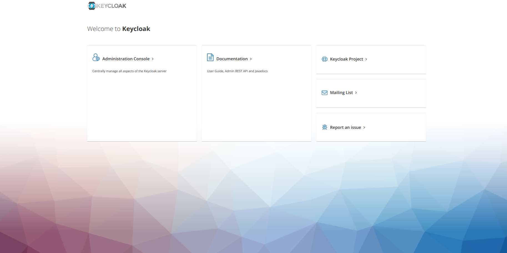
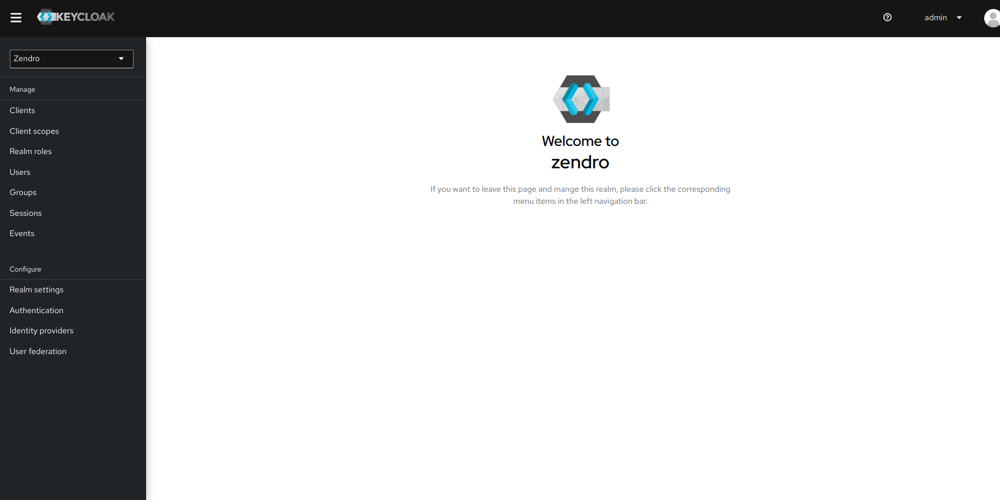
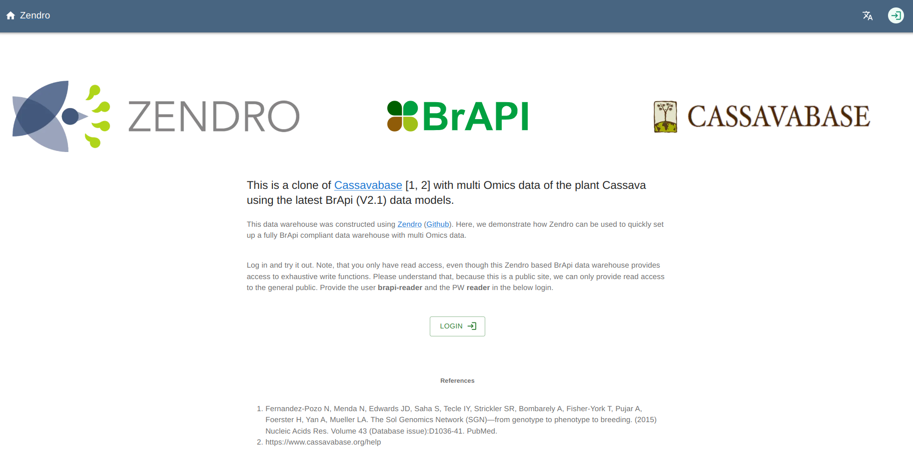
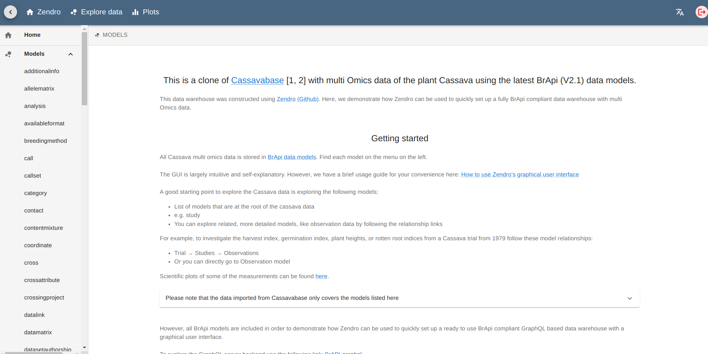
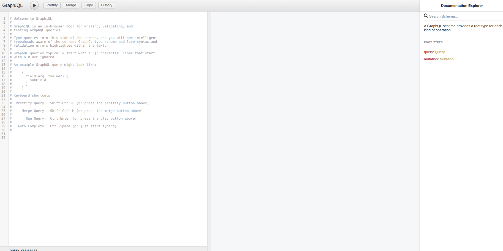

# Convert BrAPI schemas to Zendro type models

In this repo you can find a ready to use Zendro instance without models. This means you have to generate your own json data models, generate migrations for zendro and run the instance. 


## Project Requirements:
 * [NodeJS](https://nodejs.org/en/) version 18+ is required.
 * [docker](https://docs.docker.com/get-docker/)
 * [docker compose plugin](https://docs.docker.com/compose/install/#install-compose) if not already included in docker installation

 We strongly recommend to follow [this guide](https://docs.docker.com/engine/install/linux-postinstall/) to use docker without sudo.
 <br/><br/>

* * *
## Recommendations:
  * We strongly recommend you to use Zendro in Linux with or without docker.
  * If you prefer to use Zendro in Windows, we recommend you to use it with Windows Subsystem for Linux (WSL).
  * If you prefer to use Zendro in Mac, we recommend you to use it without docker.

 <br/>

* * *


## Convert nested models to flatten models
For doing so, you must have the BrAPI schema without nested JSON objects, so you have to convert this kind of arrays:

```
"crossAttributes": {
    "description": "Set of custom attributes associated with a cross",
    "items": {
        "description": "a custom attributes associated with a cross",
        "properties": {
            "crossAttributeName": {
                "description": "the human readable name of a cross attribute",
                "type": [
                    "null",
                    "string"
                ]
            },
            "crossAttributeValue": {
                "description": "the value of a cross attribute",
                "type": [
                    "null",
                    "string"
                ]
            }
        },
        "type": "object"
    },
    "type": [
        "null",
        "array"
    ]
}
```
to an extra model called crossAttributes with keys crossAttributeDbId, crossAttributeName and crossAttributeValue:
```
"CrossAttribute": {
    "properties": {
        "crossAttributeDbId": {
            "description": "the unique identifier for a custom attributes associated with a cross",
            "type": "string"
        },
        "crossAttributeName": {
            "description": "the human readable name of a cross attribute",
            "type": [
                "null",
                "string"
            ]
        },
        "crossAttributeValue": {
            "description": "the value of a cross attribute",
            "type": [
                "null",
                "string"
            ]
        }
    },
    "required": [
        "crossAttributeDbId"
    ],
    "title": "CrossAttribute",
    "type": "object"
}
```
and make the correct association to the new model.

## Zendro converter
Once you have your flatten models you can use the [Zendro converter](https://github.com/LzLang/Zendro-Converter.git) to convert BrAPI models to files that Zendro can understand (the correct input model files for Zendro).

Please follow the steps in [Zendro converter](https://github.com/LzLang/Zendro-Converter.git).

### Install Zendro

Execute these commands to install Zendro:

```
$ git clone https://github.com/Zendro-dev/zendro.git
$ cd zendro
$ npm install
$ sudo npm link
```

Then go out of the `zendro` folder and execute these commands to set up a BrAPI-Zendro instance:

```
$ git clone https://github.com/Zendro-dev/brapi_data_warehouse.git
$ cd brapi_data_warehouse
$ cd brapi_without_models
```

and put the result data models of the converter in the `data_model_definitions` folder in `brapi_without_models` folder.


## Migrations

One you have the models in `data_model_definitions` folder, go to the root of the project (`brapi_without_models`) and execute:

```
$ zendro generate -m
```

### Start up

Build and start the docker containers via:

```
$ zendro dockerize -u -p
```

This command will create docker containers for each Zendro component:
* [Keycloak](https://zendro-dev.github.io/oauth.html): manage users and roles
* [Single Page App (SPA)](https://github.com/Zendro-dev/single-page-app): graphical interface to send CRUD requests to a Zendro GraphQL endpoint
* [API](https://github.com/Zendro-dev/graphql-server): CRUD API that can be accessed through a GraphQL query language


You can check docker containers by:
```
$ docker ps
```

You can check docker logs by:
```
$ docker logs -f <container name>
```

> ***Please wait until logs indicate the app is running on XXXX port to access Zendro services.***

In default config, the running containers will be:

* Keycloak: 
    * http://localhost:8081/auth
    
      * The default keycloak username is *admin* and the password is *admin*.

  
  

* SPA: 
    * http://localhost:8080

      * The default zendro username is *zendro-admin* and the password is *admin*.

  
  

* GraphQL API: 
    * http://localhost:3000/graphql

  


### Configuration (optional)

You can change the configuration via `.env` files:

* **SPA in development mode:** ./single-page-app/.env.development
* **SPA in production mode:** ./single-page-app/.env.production


In case you want Zendro to talk to other databases, you can configure that in `config/data_models_storage_config.json`. Currently a default local database is used.

### Shut down

Execute this command to stop Zendro

```
$ zendro dockerize -d -p
```

If you want to remove all volumes, execute:

```
$ zendro dockerize -d -p -v
```


## Learn more 

Please for more details and documentation about Zendro go to [this link](https://zendro-dev.github.io/).